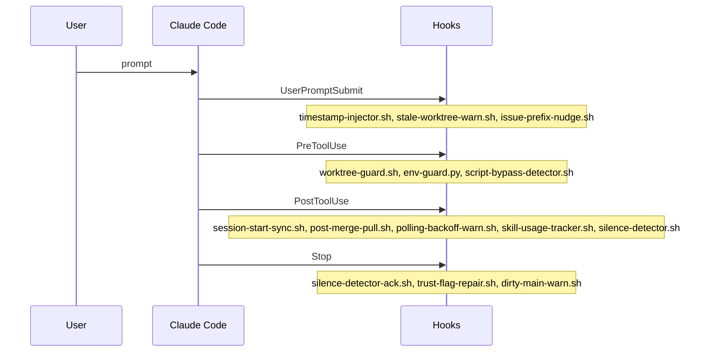

# Diagram: Hook lifecycle (this repo)

<!-- STUB: map UserPromptSubmit / PreToolUse / PostToolUse / Stop to our scripts; compare to upstream event list -->

```mermaid
sequenceDiagram
  participant U as User
  participant CC as Claude Code
  participant H as Hooks
  U->>CC: prompt
  CC->>H: UserPromptSubmit
  Note over H: timestamp-injector.sh, stale-worktree-warn.sh, issue-prefix-nudge.sh
  CC->>H: PreToolUse
  Note over H: worktree-guard.sh, env-guard.py, script-bypass-detector.sh
  CC->>H: PostToolUse
  Note over H: session-start-sync.sh, post-merge-pull.sh, polling-backoff-warn.sh, skill-usage-tracker.sh, silence-detector.sh
  CC->>H: Stop
  Note over H: silence-detector-ack.sh, trust-flag-repair.sh, dirty-main-warn.sh
```
