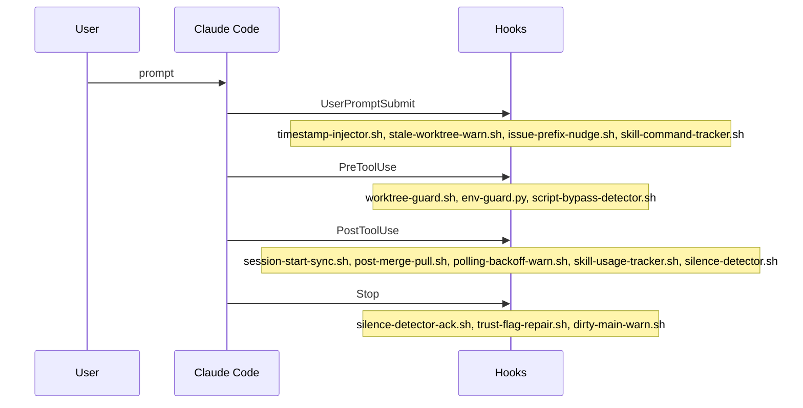

# Diagram: Hook lifecycle (this repo)

<!-- STUB: map UserPromptSubmit / PreToolUse / PostToolUse / Stop to our scripts; compare to upstream event list -->

Skill telemetry straddles two of these events (#584): `skill-command-tracker.sh` catches user-typed slash commands at UserPromptSubmit — they arrive pre-expanded and never produce a `Skill` tool call — while `skill-usage-tracker.sh` catches model-initiated calls at PostToolUse. Both write through `.claude/hooks/lib/skill-usage-recorder.sh`, which dedupes so an invocation seen by both paths still counts once. See `.claude/memory/skill_usage_telemetry.md`.
