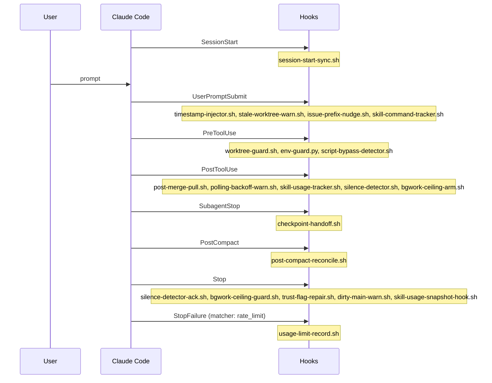

# Diagram: Hook lifecycle (this repo)

**`statusLine` is deliberately absent from this diagram.** It is a settings surface, not a hook event — Claude Code runs it from the interactive render loop on a timer, not from the event dispatcher — so it has no place in an event sequence. It is nonetheless *deployed* like a hook (same placeholder path, same `register-hooks.py` resolution). Give it its own box if this stub ever grows a config-surface diagram; do not add it as an event here. See ARCHITECTURE.md "Status Line" (#779).

The silence machinery straddles both events twice over (#803). `silence-detector.sh` / `silence-detector-ack.sh` cover silence *within* a turn; `bgwork-ceiling-arm.sh` / `bgwork-ceiling-guard.sh` cover silence *after* one ends, which is the case no PostToolUse hook can see — a thread waiting on a subagent makes no tool calls. The arm hook advises; only the Stop hook enforces, by returning `decision: block` so an unarmed turn cannot end. See `.claude/reference/bgwork-ceiling.md`.

Skill telemetry straddles two of these events (#584): `skill-command-tracker.sh` catches user-typed slash commands at UserPromptSubmit — they arrive pre-expanded and never produce a `Skill` tool call — while `skill-usage-tracker.sh` catches model-initiated calls at PostToolUse. Both write through `.claude/hooks/lib/skill-usage-recorder.sh`, which dedupes so an invocation seen by both paths still counts once. See `.claude/memory/skill_usage_telemetry.md`.
