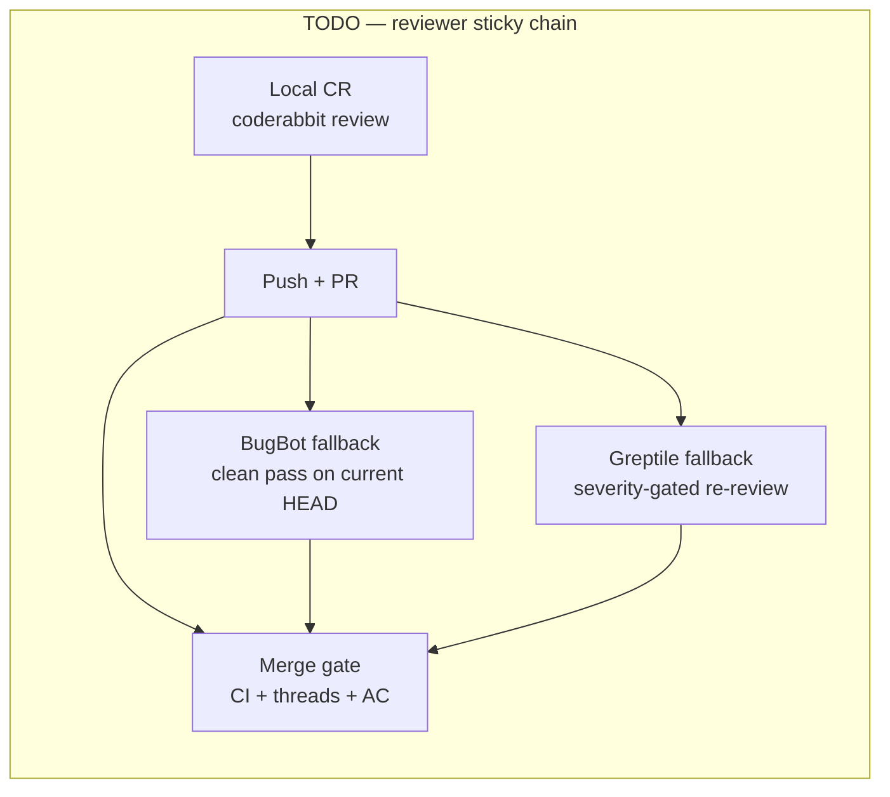

# Diagram: Review and merge pipeline

<!-- STUB: add decision diamonds for CR / BugBot / Greptile; cite cr-merge-gate.md -->

```mermaid
flowchart LR
  subgraph TODO["TODO — reviewer sticky chain"]
    L["Local CR<br/>coderabbit review"]
    P["Push + PR"]
    B["BugBot fallback<br/>clean pass on current HEAD"]
    X["Greptile fallback<br/>severity-gated re-review"]
    G["Merge gate<br/>CI + threads + AC"]
  end
  L --> P --> G
  P --> B --> G
  P --> X --> G
```
