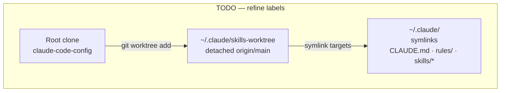

# Diagram: Skills worktree and symlink topology

<!-- STUB: replace TODO nodes with final labels; align with ARCHITECTURE.md -->

```mermaid
flowchart TB
  subgraph TODO["TODO — refine labels"]
    R["Root clone<br/>claude-code-config"]
    W["~/.claude/skills-worktree<br/>detached origin/main"]
    H["~/.claude/<br/>symlinks<br/>CLAUDE.md · rules/ · skills/*"]
  end
  R -->|"git worktree add"| W
  W -->|"symlink targets"| H
```
