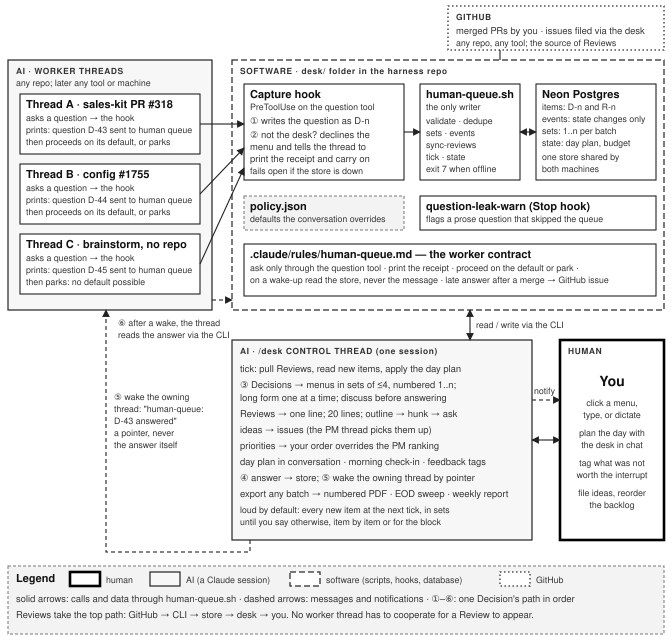
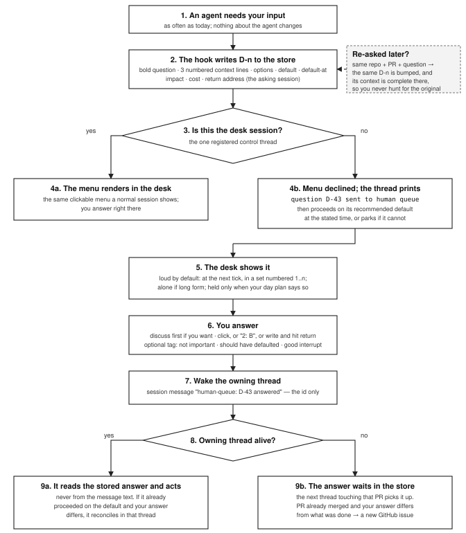
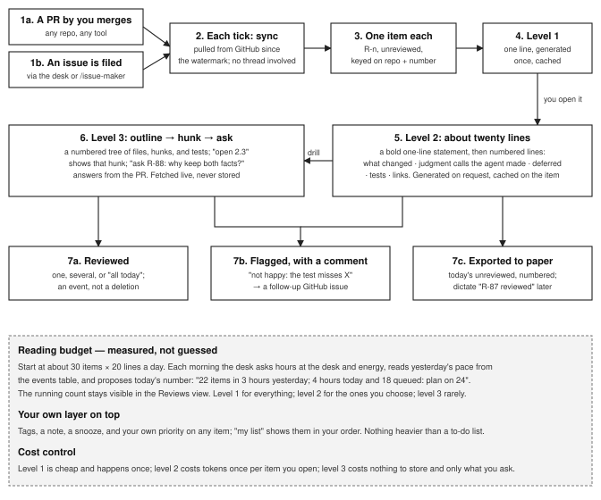
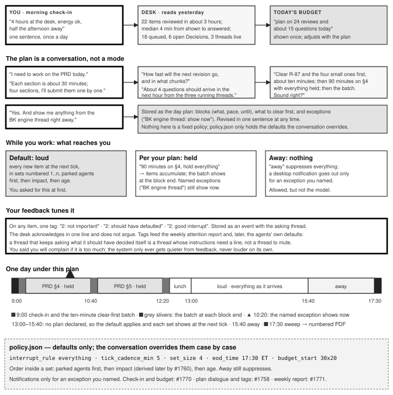
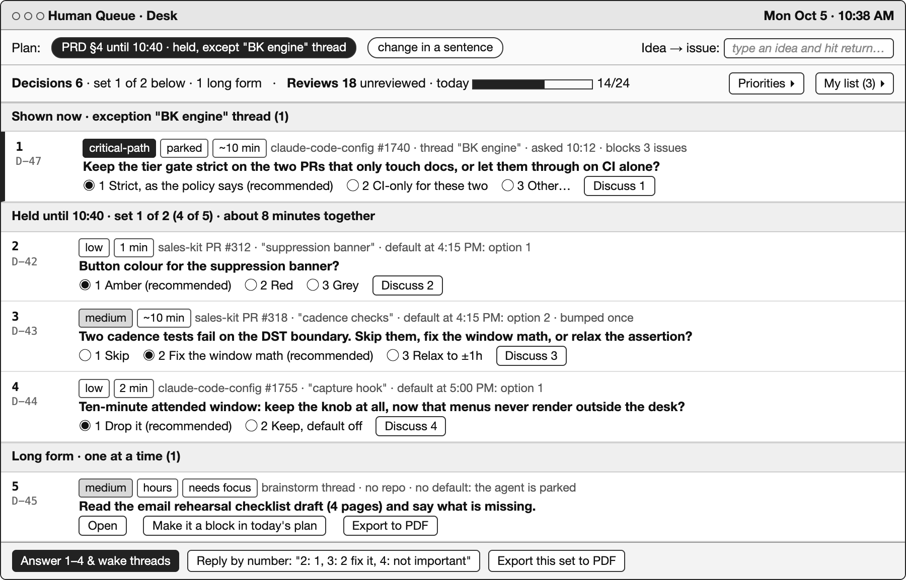
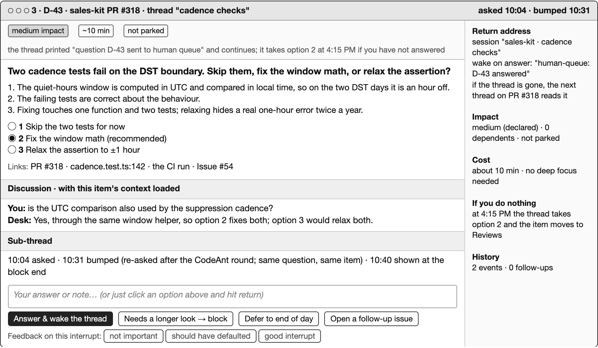
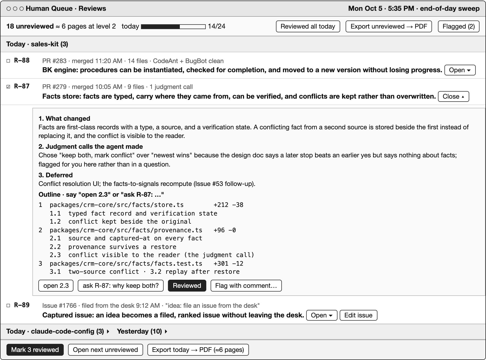

# Human Queue — design summary (version 2)

Decisions, Reviews, Ideas, and Priorities for every thread, answered from one desk.

Design summary, version 2 · Monday, October 5, 2026 · Revised from the operator's notes on version 1 · Status: 18 open issues in auerbachb/claude-code-config, #1754–#1772 (#1761 closed as superseded), nothing built yet. This folder, `desk/`, is where the code lands (issue #1754), so the project can be spun out later.

## 1. Why

As a human coding with AI, managing many agent threads at once, you want to spend your attention where only you add value. There are three surfaces.

1.1 **Getting an idea into work.** You have an idea and want it filed as a well-formed issue that the PM thread picks up, without a detour through another thread.

1.2 **Coding.** You want as much autonomous progress as the agents can give, and you like the current rate at which they ask you questions, because that is what keeps the work correct.

1.3 **Reviewing landed work.** You want to stay on top of your own mental model of the product, both what it does and the technical decisions behind it, so you keep being a useful resource to the threads.

The problem today: the questions are hard to stay on top of and cumbersome to answer. Non-blocking ones land inline in a thread and get lost, or you find them after the context is gone. Real answers take tens to hundreds of words, so you copy the question block into a text editor, write, and paste back. Reviewing means cobbling prompts together and organizing everything yourself.

The premise is "human as an API". You are the bottleneck of cognition, and you hold work only a human can do, such as setting and verifying objectives. So the system buffers everything that needs you, prioritizes it as well as it can, and you simply answer. You never need to know which thread to paste into, whether there is one thread or a million, or where in the AI's flow a message fits. You care about two things: blockers, and work you may want to understand or adjust.

## 2. The design, revised

2.1 **Four surfaces, one desk.** *Decisions*: questions that hold an agent. *Reviews*: landed work, one item per merged PR and per filed issue. *Ideas*: file an issue from the desk; the PM thread picks it up on its next scan. *Priorities*: reorder the backlog from the desk; the PM ranking honors your order. One store, one CLI, one control thread: `/desk`.

2.2 **Nothing changes about the agents.** They ask as often as they do today and decide on their own as much as they do today. Only delivery changes.

2.3 **Single point of contact.** A question never renders in the thread that asked it. The hook writes it to the store and declines the menu; the thread prints one receipt line, `question D-43 sent to human queue`, and proceeds on its recommended default or parks. No duplication anywhere. In the desk, questions render as the same clickable menus a normal session shows.

2.4 **Push for questions, pull for work.** Decisions must be pushed, because only the asking thread knows the question. The hook is deterministic, so a cheaper model or a full context window cannot forget it. The one leak is a question written as prose: a short written contract plus a stop-time nudge covers it, with a transcript scan as the later safety net. Reviews and filed issues are pulled from GitHub, so no thread has to cooperate.

2.5 **The item contract, kept light.** A bold one-sentence question, up to three numbered context lines, options, the recommended default and the time it applies, impact, cost, status, answer. Logging is state changes only, a dozen bytes each: asked, bumped, shown, answered, reviewed, flagged, feedback. No transcripts, no diffs. A twenty-line summary is generated once and cached; the diff is never stored.

2.6 **Answering.** Simple questions come in sets of up to four, the menu tool's limit, numbered 1 to n per set, numbering reset each time; the long id is visible but never required. Long-form questions come one at a time: write, hit return, routed. Multipart questions come piece by piece. "discuss 2" lets you talk about one question with its context loaded before answering. The answer goes to the store; the owning thread is woken with a pointer and reads the store; a dead thread loses nothing; a late answer after a merge opens a GitHub issue.

2.7 **Reviews and drill-down.** One line per item; twenty lines on request as a bold line plus a numbered list; then a numbered outline of the PR, files to hunks to tests, that you open by number and ask about. A flag becomes a follow-up issue. Issues filed through the desk come back to you the same way, so you can check what was captured.

2.8 **Planning your attention together.** Loud by default: every item at the next tick, in sets. You tell it to back off item by item with stored tags: not important, should have defaulted, good interrupt. The day is planned in conversation: "I need to work on the PRD", the desk asks about pace and chunking, forecasts incoming questions, proposes what to clear first, and you confirm. Away still suppresses. A morning check-in plus yesterday's measured pace sets today's reading budget, starting from the 30 × 20 guess. A personal to-do layer comes early; a weekly attention report measures what the queue costs you.

2.9 **Storage and home.** Postgres on Neon from day one, the operator's call: both machines share one queue, migrations are real, and it is the CRM's engine. The hook fails open when the database is unreachable. Everything lives in this top-level `desk/` folder so it can be spun out later. Phone access, other coding tools, and scan import stay backlog.

## 3. The GitHub issues

Fourteen build issues and four backlog issues in auerbachb/claude-code-config. Build order: #1754 first; then #1755 and #1756 in parallel; then #1765; then #1757; then #1758; then the six desk extensions and the two polish items in parallel. Planning bound for the build is 48.5 hours; the backlog adds 14.

| # | Title | What it gets you | Est | After |
|---|-------|------------------|-----|-------|
| [#1754](https://github.com/auerbachb/claude-code-config/issues/1754) | Neon Postgres store + human-queue.sh CLI, in desk/ | Shared Neon store and CLI for questions and landed work | 5h | — |
| [#1755](https://github.com/auerbachb/claude-code-config/issues/1755) | Capture hook sends questions to the store, not the thread | Questions go to the store and never render outside the desk | 3h | 1754 |
| [#1756](https://github.com/auerbachb/claude-code-config/issues/1756) | Reviews sync from merged PRs and filed issues + summaries | PRs and filed issues become reviewable items, summarized as deep as asked | 3h | 1754 |
| [#1765](https://github.com/auerbachb/claude-code-config/issues/1765) | Worker contract rule + prose-question nudge | One written contract for workers; prose questions that bypass the queue get flagged | 5h | 1755 |
| [#1757](https://github.com/auerbachb/claude-code-config/issues/1757) | /desk 1/2: Decisions in sets, discuss, answer, wake-ups | Every question answered from one desk, by menu, by number, or in prose, and routed back | 5h | 1755, 1756 |
| [#1758](https://github.com/auerbachb/claude-code-config/issues/1758) | /desk 2/2: Reviews, day plan, feedback-tuned interrupts | Reviews view, and a day plan agreed in conversation that decides when questions reach you | 5h | 1757 |
| [#1766](https://github.com/auerbachb/claude-code-config/issues/1766) | /desk: file an idea as an issue from the desk; /pm picks it up | An idea becomes a filed, ranked issue without leaving the desk | 3h | 1757 |
| [#1767](https://github.com/auerbachb/claude-code-config/issues/1767) | /desk: reprioritize the backlog; operator order overrides /pm ranking | You reorder the backlog from the desk and the PM thread honors it | 3h | 1757 |
| [#1768](https://github.com/auerbachb/claude-code-config/issues/1768) | /desk: PR drill-down MVP: numbered outline of a PR and chat about it | A PR explored by number, hunk by hunk, and questioned in conversation | 3h | 1758 |
| [#1769](https://github.com/auerbachb/claude-code-config/issues/1769) | /desk: personal to-do layer: tags, notes, snooze, my-priority on items | Your own tags, notes, and order live on the items | 3h | 1758 |
| [#1770](https://github.com/auerbachb/claude-code-config/issues/1770) | /desk: morning check-in and adaptive reading budget from your own data | Today's budget from measured pace, today's hours, and energy | 3h | 1758 |
| [#1771](https://github.com/auerbachb/claude-code-config/issues/1771) | /desk: weekly attention report from the events table | A one-page weekly measure of what the queue costs you | 1h30 | 1758 |
| [#1759](https://github.com/auerbachb/claude-code-config/issues/1759) | Export any batch to a numbered PDF for paper review | A printable, numbered copy of any batch to review and answer on paper | 3h | 1758 |
| [#1760](https://github.com/auerbachb/claude-code-config/issues/1760) | Derive item impact from PM backlog rank and dependents | Items rank by what they really unblock | 3h | 1758 |
| [#1762](https://github.com/auerbachb/claude-code-config/issues/1762) | Backlog: Codex/Cursor/other accounts as Decision sources | Questions from other coding tools land in the same queue | 5h | later |
| [#1763](https://github.com/auerbachb/claude-code-config/issues/1763) | Backlog: phone access to Decisions and Reviews | Clear one-tap questions from a phone | 3h | later |
| [#1764](https://github.com/auerbachb/claude-code-config/issues/1764) | Backlog: import answers from an annotated, scanned PDF | Pen-marked printouts come back as proposed answers to confirm | 3h | later |
| [#1772](https://github.com/auerbachb/claude-code-config/issues/1772) | Backlog: comprehension check on delivered work | The desk checks your understanding of landed work | 3h | later |

Closed as superseded: #1761 (cross-machine sync), because the store is on Neon from day one.

## 4. Decision points

### 4.1 Settled by the operator, October 2 and October 5

4.1.1 Names: Decisions and Reviews; the control skill is `/desk`; the code lives in this `desk/` folder.

4.1.2 Single point of contact replaces the earlier ten-minute rule: a question never renders in a worker thread; the thread prints a receipt and carries on.

4.1.3 Interrupts are loud by default and tuned down by feedback, item by item. The day is planned in conversation; do-not-disturb exists but is not the model.

4.1.4 Postgres on Neon from day one. The capture hook is split into mechanism (#1755) and contract (#1765). Filed issues are pulled into Reviews. The weekly attention report is filed (#1771). The reading budget starts as a guess and adapts to measured pace, hours, and energy (#1770). No state line is printed in chat unasked. The "day one card" idea is dropped.

4.1.5 Unchanged from October 2: agent autonomy and question rate; summaries lazy and layered; a late answer after a merge opens a GitHub issue; phone, other tools, and scan import stay backlog.

### 4.2 Calls made when filing, cheap to reverse

4.2.1 Neon from day one makes #1761 moot; it is closed as superseded by #1754, which grew to a Heavy estimate (migrations, Postgres client, fail-open behavior).

4.2.2 The hook split's seam is mechanism versus contract, not "mirror first, deny later", because a mirror-only phase would have duplicated questions, which the operator ruled out.

4.2.3 Single point of contact applies even to a worker thread the operator is sitting in: its menu never renders there, though a plain reply can still be typed.

4.2.4 Four questions per menu and four options per question are the question tool's limits, not the design's; sets chain with "next".

4.2.5 The fixed focus policy is gone; what survives is the order inside a set: parked agents first, then impact, then age. Ideas go through a one-shot entry into the issue-maker machinery so the desk never flips into capture mode.

## 5. Diagrams

### 5.1 System architecture: who is human, who is AI, what is software

Figure 5.1. Three kinds of actor, each in its own box: the human, the AI sessions, and the software in `desk/`. Every question goes through the hook into the store and never renders outside the desk; answers return as pointers and the thread reads the store. Reviews take the top path: GitHub → CLI → store → desk → human.

### 5.2 Life of a Decision, single point of contact

Figure 5.2. The only fork at capture time is "is this the desk?". Everywhere else the question leaves a one-line receipt and the thread carries on. The store is the truth at every step; messages only point at it.

### 5.3 Life of a Review

Figure 5.3. Reviews are pulled from GitHub, including issues filed through the desk, so a merged PR from any tool and any captured idea shows up without that tool knowing the queue exists. Depth is the operator's to choose.

### 5.4 Planning your attention together

Figure 5.4. Attention is planned in conversation each day and adjusted in one sentence; the loud default and the feedback tags replace version 1's fixed policy. Do-not-disturb stays available without being the model.

### 5.5 A day with the desk, in short

You open the desk once. It tells you yesterday's pace and asks how long you have. You say the morning is for the PRD, a section at a time; it proposes clearing one review and four small questions first, then holding everything for ninety minutes; you add one exception. Only that exception reaches you during the block; at its end the held set appears numbered 1 to 4 and you click through it. After lunch you declare no plan, so every new item shows at the next tick, and you tag two "should have defaulted". At 5:30 the sweep lists what is left; you export it to paper and dictate answers by number in the morning.

## 6. UI mockups, as thinking aids

The real surface is the `/desk` chat thread with its clickable menus. These screens exist to make the workflow concrete. Anything they show, the chat version shows as a numbered set and a menu; nothing on them is printed in chat unasked.

### 6.1 The desk, home

Mockup 6.1. One screen answers: what is reaching me now and why, what is held and until when, what my reading budget looks like today. Items carry a set number you reply to and a long id you can ignore. Ideas and priorities have their own entry points so you never leave the desk.

### 6.2 One Decision, with discussion before answering

Mockup 6.2. One item carries everything needed to answer it in seconds: the bold question, three numbered context lines, the options with the recommended default, what happens if you do nothing, and where the answer goes. You can talk about it first, and tag the interrupt afterwards.

### 6.3 Reviews, with the drill-down outline

Mockup 6.3. One line per item is the default; the twenty-line view is a bold line plus numbered points; below it the outline lets you open one hunk by number or ask about the PR. A filed issue comes back the same way so you can check what was captured.

## 7. Open questions for the operator

Every item here is already encoded somewhere in the issues; an answer changes an issue, not the design.

7.1 Neon from day one, and #1761 closed as superseded. Confirm? (yes / no, start on SQLite and migrate later)

7.2 Single point of contact applies even to the worker thread you are typing in: its menu never renders; you can still type a plain reply there. OK? (yes / exempt the thread I am actively typing in)

7.3 "Loud by default" means every new item at the next tick. Tick cadence to start: (5 minutes / 1 minute / immediately, as each item arrives)

7.4 Order inside a set: parked agents first, then impact, then age. (yes / change)

7.5 An idea filed from the desk goes to which repo when the text does not say? (ask once per desk session / always sales-kit / always the harness)

7.6 The priority override for /pm: one file per repo, or one harness-wide file? (per repo, following pm-config.md / harness-wide)

7.7 Reviews for filed issues: every issue with the capture footer, or only ones filed from the desk? (every captured issue / desk-filed only)

7.8 Drill-down MVP shape: a numbered outline (files → hunks → tests) opened by number, plus "ask". Right first cut? (yes / change)

7.9 Feedback tags to start: not important · should have defaulted · good interrupt. (yes / add)

7.10 Comprehension check (#1772) stays backlog, or builds alongside the drill-down (#1768)? (backlog / build with #1768)

7.11 Build start: #1754 first, in a thread opened in this repo. When? (now / after …)

7.12 Anything in sections 1 or 2 that still does not read the way you think about it?

## 8. How to resume this work on another machine

8.1 Pull `main` of this repo; this document and its figures are in `desk/`.

8.2 Read `desk/DESIGN.md` (this file), then the issue bodies in build order: #1754, #1755 and #1756, #1765, #1757, #1758, then the rest.

8.3 Start with `/start-issue 1754` from a thread opened in this repo. Provision the Neon project once with `neonctl` and export `HUMAN_QUEUE_DATABASE_URL` in that machine's shell profile; never commit it.

8.4 The operator's answers to section 7 may arrive on paper or by dictation; apply them as `/update` edits to the issues they name.

Source of this document: generated from the version 2 PDF delivered to the operator on 2026-10-05; the PDF and this Markdown carry the same content.
